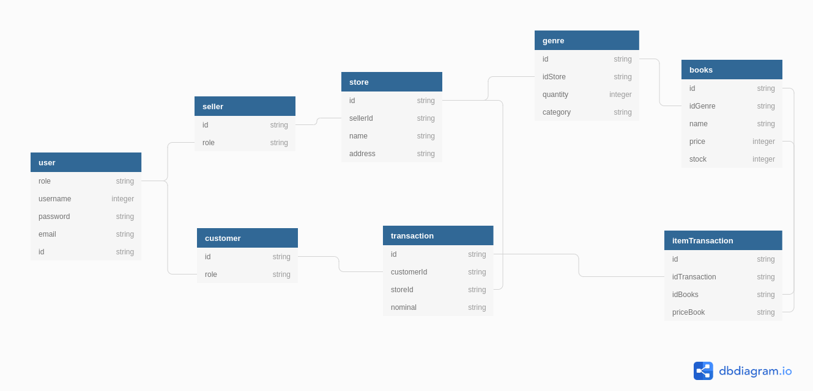

# BOOK APPSTORE Version 1.0.0
This project provided by Glints & Binar Academy
## Team Member
Project Manager : Nanda Nugraha

Team's Member :
- Muhammad Fitranatanegara
- Septian Maulidho
- Irwan Ardiansyah
- Muhammad Agus Rifa'i
- Sudi Hardi
- Irvan

Group B - Morning Class
----------
## BOOK APPSTORE FEATURE
### EXPLANATION AND ROUTES 
#### Feature Create an Account, Edit Profile Account, Open / Read data account, and Delete Account.

```bash
Update :/profile/seller/
Delete :/profile/seller
Read :/profile/seller
```

```bash
Update :/profile/customer/
Delete :/profile/customer
Read :/profile/customer
```

#### Feature Create, Edit, Read, and Delete Data Store for Seller (Only).

```bash
Create :/stores
Read :/stores
Update :/stores
Delete :/stores
```

#### Feature to Create. Edit, Read and Delete genre of books for Seller (only)
```bash
Create :/genre
Read :/genre
Update :/genre
Delete :/genre
```
#### Customer can read genre only (using authenticate as customer)
```bash
Read: /genre
```

#### Feature to Create. Edit, Read and Delete list of books for Seller (only)
```bash
Create :/books
Read :/books
Update :/books
Delete :/books
```
#### Customer can read list of books only (using authenticate as customer)
```bash
Read: /books
```

#### Feature to Create and Read transaction for Customer (only)
```bash
Create :/transaksi
Read :/transaksi
```

#### Seller can read transactions only (using authenticate as seller)
```bash
Read: /transaksi
```

#### Feature to read items in transaction for Seller and Customer.
```bash
Read: /transaksi/item
Create: /transamsi/item
```

#### Feature Login & Register
```bash
Read: /login
Create : /register
```

###### Burong Puyoh Inc.
----------
## DATA SCHEME
